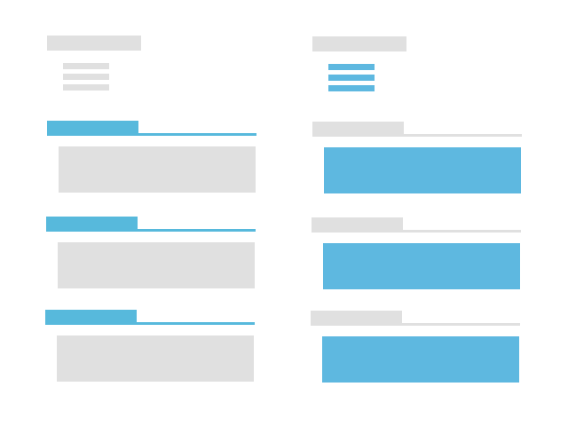

# biteydown

Convert your curriculum vitae in [Markdown] syntax to HTML or PDF file.

### Installation

    $ git clone git@github.com:arturoherrero/biteydown.git
    $ bundle install

### Usage

    $ bin/biteydown -help
    Usage: biteydown [options] markdown_file.md
            --html                       Create HTML file
            --pdf                        Create PDF file
            --css file                   Path to CSS file
        -h, --help                       Display help

    $ bin/biteydown --html --pdf example/curriculum.md
    $ bin/biteydown --pdf example/curriculum.md
    $ bin/biteydown --pdf --css style/style.css example/curriculum.md

### Style

You can customize the look and feel of text and headings in your document using the `style/style.css` file or a custom CSS file. First is transformed the Markdown document to HTML file and then apply the style. It's a little bit hacky, but works fine.

Markdown is a lightweight markup language designed as an easy-to-read, easy-to-write plain text format and then convert it to structurally valid HTML; therefore, CSS selectors can be used to customize the curriculum.

CSS works by associating rules with HTML elements. In this case, there are a little group of selectors that can be used: `h1-h6`, `blockquote`, `a`, `li`, `code`, `strong`, `em`, `img`. You cannot use id or class selectors to create rules that apply to elements.

[Markdown]: http://daringfireball.net/projects/markdown/
